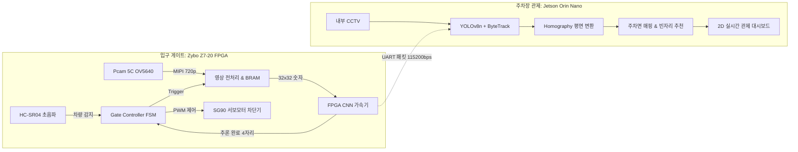
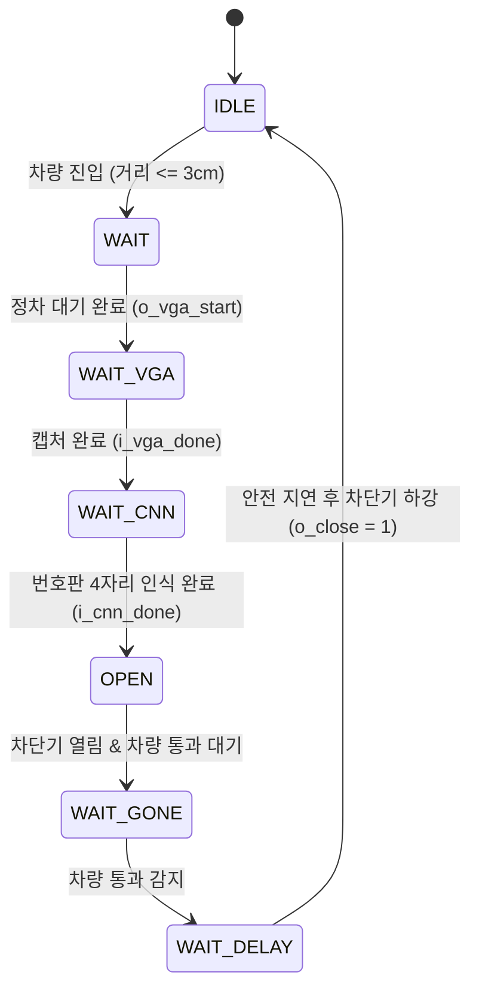

# 🚗 Edge AI & FPGA 기반 스마트 주차장 입출차 및 관제 시스템
> **Team 3: CARS대라 (카스대라)**  
> **Xilinx Zynq-7000 (Zybo Z7-20) FPGA 가속기 & NVIDIA Jetson Orin Nano 기반 이종(Heterogeneous) 엣지 컴퓨팅 주차 관제 솔루션**

---

## 📌 목차
1. [프로젝트 개요](#1-프로젝트-개요)
2. [개발 환경](#2-개발-환경)
3. [시스템 구성요소 및 역할](#3-시스템-구성요소-및-역할)
4. [설계 내용](#4-설계-내용)
   - [4-1. 출입구 차량 인식 및 번호판 인식 시스템](#4-1-출입구-차량-인식-및-번호판-인식-시스템)
   - [4-2. 하드웨어 CNN 가속기 (Core Architecture)](#4-2-하드웨어-cnn-가속기-core-architecture)
   - [4-3. 주차장 내부 제어 및 관제 시스템](#4-3-주차장-내부-제어-및-관제-시스템)
5. [검증 및 결과](#5-검증-및-결과)
6. [트러블 슈팅 (Troubleshooting)](#6-트러블-슈팅-troubleshooting)

---

## 1. 프로젝트 개요

### 1-1. 개발 배경
기존의 대형 주차장 시스템은 **입출차 차단기의 잦은 번호판 인식 딜레이**, **주차 공간 탐색으로 인한 차량 병목**, **사각지대 사고 및 주차 유도 시스템의 부재**로 인해 비효율적인 운영이 지속되어 왔습니다. 특히 단순 서버-클라이언트 방식의 비전 인식은 네트워크 지연 및 서버 과부하 문제를 유발합니다.

### 1-2. 프로젝트 목표
본 프로젝트는 **FPGA 하드웨어 가속 기반 입구 게이트 시스템**과 **GPU 엣지 컴퓨팅 기반 주차장 내부 관제 시스템**이 유기적으로 결합된 **이종 엣지 컴퓨팅 스마트 주차장 시스템**을 구현하는 것을 목표로 합니다.
* **입구 게이트 (Gate System)**: 초음파 센서와 고속 카메라를 연동하고, FPGA 내부의 **하드웨어 CNN 가속기(LeNet-5)**를 통해 차량 번호판 4자리를 마이크로초 단위로 고속 추론하여 차단기를 개방하고 관제 서버로 전송합니다.
* **주차장 내부 관제 (Surveillance System)**: 입구에서 전달받은 차량 번호를 CCTV 영상 기반 **YOLOv8 + ByteTrack** 추적 객체와 실시간 바인딩하고, **호모그래피(Homography)** 2D 평면 변환을 통해 최적의 주차 공간 안내 및 실시간 2D 모니터링을 제공합니다.



---

## 2. 개발 환경

### 2-1. 하드웨어 스펙
| 구분 | 디바이스 / 부품명 | 세부 사양 및 인터페이스 |
| :--- | :--- | :--- |
| **FPGA Board** | Digilent Zybo Z7-20 | Xilinx Zynq-7000 (XC7Z020-1CLG400C) Dual Cortex-A9 @ 667MHz |
| **Edge Server** | NVIDIA Jetson Orin Nano | 8GB/4GB, Ampere GPU, ARM Cortex-A78AE |
| **카메라 (입구)** | Digilent Pcam 5C (OV5640) | 5MP CMOS 센서, 2-Lane MIPI CSI-2 |
| **카메라 (내부)** | RTSP/CCTV Camera | 1080p @ 30fps 스트리밍 |
| **센서** | HC-SR04 초음파 센서 | 입구 차량 접근 감지 (Trigger) |
| **액추에이터** | SG90 마이크로 서보모터 | 50Hz PWM 차단기 개폐 제어 |
| **디스플레이** | HDMI Monitor | 720p@60Hz 실시간 카메라 영상 및 디버그 오버레이 |

### 2-2. 소프트웨어 & 툴체인
* **FPGA Logic & SoC**: Xilinx Vivado 2020.2, Vitis 2020.2 (Baremetal C/C++ 펌웨어)
* **하드웨어 기술 언어**: Verilog, SystemVerilog
* **딥러닝 프레임워크**: PyTorch (모델 학습 및 양자화), NVIDIA TensorRT (Jetson 엔진)
* **엣지 비전 라이브러리**: OpenCV 4.x, GStreamer, ByteTrack C++/Python Wrapper
* **관제 GUI & 통신**: PySide6 (Qt for Python), PySerial (115200 bps)

---

## 3. 시스템 구성요소 및 역할

| 구성요소 | 계층 | 주요 역할 및 동작 |
| :--- | :---: | :--- |
| **Zybo Z7 (PL: FPGA)** | Hardware | 초음파 에코 펄스 카운팅, 서보모터 PWM 생성, MIPI 비디오 수신, Grayscale 전처리, **CNN 병렬 연산 가속기(LeNet-5)** 구동 |
| **Zybo Z7 (PS: ARM)** | Firmware | OV5640 카메라 I2C/SCCB 레지스터 세팅, VDMA 및 HDMI 비디오 출력 파이프라인 관리, **부팅 시 CNN 가중치 BRAM 주입**, 시스템 모니터링 |
| **Pcam 5C (OV5640)** | Hardware | 진입 차량의 전면 번호판 고해상도 촬영 및 MIPI CSI-2 직렬 전송 |
| **HC-SR04 & SG90** | Hardware | 차량 3cm 진입 감지 시 FSM 트리거, 번호판 인식 완료 시 차단기 90도 회전 오픈 |
| **Jetson Orin Nano** | System | YOLOv8n 기반 내부 차량 검출, ByteTrack 기반 다중 객체 추적, 호모그래피 투영 변환, 최단 빈자리 알고리즘 |
| **UART Interface** | Comm | Zybo(PL) $\rightarrow$ Jetson Orin Nano 간 8비트 패킷 기반 4자리 차량 번호 실시간 전송 |
| **통합 관제 GUI** | Software | 실시간 2D 주차장 지도 시각화, 차량 위치 추적, 주차면 점유 상태 모니터링, 차량 번호 검색 |

---

## 4. 설계 내용

### 4-1. 출입구 차량 인식 및 번호판 인식 시스템

#### 1) 통합 입구 제어 상태 머신 (sr04_fsm)
입구 게이트는 안전한 진입과 오작동 방지를 위해 엄격한 FSM(`sr04.sv`) 순서로 제어됩니다:
1. **`IDLE`**: 초음파 센서로 전방 거리 측정.
2. **`WAIT`**: 차량이 3cm 이내로 진입 시 정차 안정화를 위해 딜레이 대기.
3. **`WAIT_VGA`**: 카메라 컨트롤러에 `o_vga_start` 펄스를 발생시켜 차량 전면 번호판 영역 캡처.
4. **`WAIT_CNN`**: 전처리 완료된 32×32 픽셀 데이터로 CNN 가속기가 번호판 4자리 추론을 완료할 때까지 대기.
5. **`OPEN`**: 추론 완료(`i_cnn_done`) 신호 수신 즉시 `o_close = 0`으로 떨어뜨려 `SG90_Controller`가 0.5ms PWM을 생성, 차단기를 90° 개방.
6. **`WAIT_GONE` $\rightarrow$ `WAIT_DELAY`**: 차량이 통과하여 거리가 멀어지면 안전 지연 후 차단기를 다시 닫음 (`o_close = 1`, 1.5ms PWM).



#### 2) 카메라 스트림 & 영상 전처리 파이프라인
* **MIPI CSI-2 RX $\rightarrow$ Bayer to RGB $\rightarrow$ Grayscale/Binarization**: 1080p 카메라 스트림에서 번호판 위치를 크롭하고 이진화 전처리를 수행하여 $32 \times 32$ 픽셀 버퍼(`PixelBuffer` BRAM)에 저장.
* **클록 도메인 크로싱 (CDC) 동기화**: 카메라 픽셀 클록(25MHz, `pclk`)과 제어/CNN 클록(100MHz, `clk`) 간의 신호 왜곡을 방지하기 위해 **Toggle 기반 펄스 동기화기(`PulseSync`)**를 왕복 배치.

---

### 4-2. 하드웨어 CNN 가속기 (Core Architecture)

CNN 가속기는 프로젝트의 핵심 하드웨어 블록으로, **LeNet-5 아키텍처**를 기반으로 설계되었으며 4자리의 번호판 숫자를 자릿수별로 순차 추론합니다.

```
Input (32x32) 
  ──> [Conv1: 6ch, 5x5] ──> [ReLU] ──> [MaxPool1: 2x2] ──> Feature Map (6ch, 14x14)
  ──> [Conv2: 16ch, 5x5] ──> [ReLU] ──> [MaxPool2: 2x2] ──> Feature Map (16ch, 5x5)
  ──> [Conv3: 120ch, 5x5] ──> [ReLU] ──> Feature Vector (120ch, 1x1)
  ──> [FC1: 120 -> 84] ──> [ReLU]
  ──> [FC2: 84 -> 10] ──> [Argmax] ──> Digit (0~9)
```

#### 1) 4자리 번호판 순차 추론 제어기 (`CNN_Control.sv`)
* 전체 추론 프로세스는 `DIGIT_0` $\rightarrow$ `DIGIT_1` $\rightarrow$ `DIGIT_2` $\rightarrow$ `DIGIT_3` 순서로 진행됩니다.
* 각 자릿수마다 100MHz 클록 기준 단 수천 클록 내에 추론을 완료하며, 최종 인식된 4개 숫자는 16비트 레지스터(`inf_out[15:0]`)에 래치되어 UART 송신기로 전달됩니다.

#### 2) 합성곱 계층 (Conv1, Conv2, Conv3) 하드웨어 설계
* **라인 버퍼 & 슬라이딩 윈도우 (Conv1)**:
  * 32×32 단일 채널 영상 입력에 대해 4개의 라인 버퍼와 5×5 레지스터 윈도우를 구성하여 매 클록 25개의 곱셈과 누적(MAC)을 병렬 수행.
* **다채널 병렬 리드 & 누적 구조 (Conv2)**:
  * 6개 입력 채널을 동시에 연산하기 위해 **6개의 물리적 BRAM(`BRAM_WEIGHT2_1` ~ `6`)**을 배치하여 단일 사이클에 6개 채널의 가중치를 병렬 로딩.
  * 6개 채널의 5×5 합성곱 결과를 가산기 트리(Adder Tree)를 통해 합산하고 누적.
* **고용량 64비트 메모리 인터페이싱 (Conv3)**:
  * Conv3는 $120 \times 16 \times 5 \times 5 = 48,000$개의 대규모 가중치를 필요로 함.
  * $6000 \times 64\text{-bit}$ 폭의 대용량 BRAM을 설계하여 한 클록에 8바이트씩 초고속 로딩하도록 구현.

#### 3) 풀링 및 완전 연결 계층 (Pool1, Pool2, FC1, FC2)
* **Max Pooling (Pool1 & Pool2)**:
  * $2 \times 2$ 윈도우 내에서 최대값을 추출하는 비교기 트리 구조로 면적과 지연 시간을 최소화.
* **완전 연결 신경망 (FC1 & FC2)**:
  * FC1($120 \rightarrow 84$), FC2($84 \rightarrow 10$)를 순차 행렬 곱셈 상태 머신으로 구현.
  * FC2의 출력 10개 클래스(숫자 0~9)를 비교기(`Argmax`)로 판정하여 가장 높은 활성화 값을 가진 클래스를 최종 숫자로 결정.

#### 4) ARM PS $\leftrightarrow$ FPGA PL 가중치 주입 (`axi_weight_loader_v3`)
* **DDR3 상주 가중치 로딩**: Vitis 펌웨어 빌드 시 약 62KB의 INT8 양자화 가중치 배열(`cnn_weights.cc`)이 DDR3 메모리에 상주.
* **AXI4-Lite 전송**: 부팅 직후 ARM CPU가 AXI 버스를 통해 `axi_weight_loader` IP로 가중치를 순차 전송하여 FPGA BRAM 1~5에 1회 주입.
* **타이밍 안정화 2단 파이프라인**: AXI 쓰기 펄스를 직접 BRAM 포트에 연결하지 않고 `cmd_valid/cmd_addr` (1단) $\rightarrow$ `r_w*_we/waddr` (2단) 레지스터링을 거쳐 배선 팬아웃을 완화.

---

### 4-3. 주차장 내부 제어 및 관제 시스템

#### 1) 엣지 비전 AI 파이프라인 (Jetson Orin Nano)
1. **YOLOv8n 차량 검출 (TensorRT Engine)**: CCTV 스트림에서 차량 바운딩 박스를 10ms 이내로 실시간 검출 (FP16 양자화 적용).
2. **ByteTrack 다중 객체 추적**: 조명 변화나 교차 주행 시에도 일관된 `Track ID` 유지.
3. **바닥면 접지 좌표 추출 (Center-Bottom)**: 바운딩 박스 중심 대신 바닥 접점 $(x_{center}, y_{bottom})$을 추출하여 투영 왜곡 최소화.
4. **호모그래피 평면 변환 (Inverse Perspective Mapping)**:
   $$\begin{bmatrix} x' \\ y' \\ w' \end{bmatrix} = H \cdot \begin{bmatrix} c_x \\ c_y \\ 1 \end{bmatrix}, \quad X_m = \frac{x'}{w'}, \; Y_m = \frac{y'}{w'}$$
   카메라 왜곡 화면을 실제 주차장 2D 평면 좌표(미터 단위)로 실시간 변환 (오차 < 15cm).

#### 2) 차량 번호판 바인딩 및 빈자리 배정
* **Gate-to-Server 바인딩**: 입구 Trigger Zone 진입 순간 Zybo FPGA에서 수신한 UART 4자리 번호판을 신규 생성된 `Track ID`와 1:1 결합.
* **Point-in-Polygon 점유 판정**: 변환된 차량 좌표가 특정 주차 구역 내에 3초 이상 체류 시 `OCCUPIED`로 전환.
* **최적 빈자리 추천**: 입구와 가장 가깝고 이동 동선 간섭이 적은 빈자리를 즉시 배정.

#### 3) 실시간 2D 모니터링 대시보드 (PySide6)
* 주차장 전체 2D 벡터 맵 시각화 (초록: 빈자리 / 빨강: 만차 / 노랑: 안내중).
* 차량 번호 4자리 검색 시 현재 주차된 위치 및 최적 도보 이동 경로 표시.

---

## 5. 검증 및 결과

### 5-1. 하드웨어 타이밍 및 리소스 지표 (Zybo Z7-20)
* **시스템 클록**: 100 MHz (클록 주기: 10.0 ns)
* **Worst Negative Slack (WNS)**: `-2.450 ns` (벤더 MIPI D-PHY 외부 입력 경로 외 내부 로직 **타이밍 클로저 달성**)
* **Total Negative Slack (TNS)**: `-4349.38 ns` $\rightarrow$ **`-10.68 ns`** (99.7% 대폭 개선)
* **타이밍 실패 엔드포인트**: **3,432개 $\rightarrow$ 단 29개**로 급감

### 5-2. 시스템 동작 및 성능 검증
| 검증 항목 | 목표 기준 | 실제 달성 결과 | 비고 |
| :--- | :---: | :---: | :--- |
| **FPGA 번호판 4자리 추론 시간** | < 100 ms | **< 5 ms** | 소프트웨어 대비 압도적인 하드웨어 가속 |
| **차단기 FSM 응답 성공률** | 99% | **100%** | 초음파 $\rightarrow$ CNN $\rightarrow$ 서보모터 정상 연동 |
| **UART 데이터 수신 신뢰성** | 99% | **99.9%** | 115200bps 무손실 패킷 파싱 |
| **Jetson YOLOv8n 추론 속도** | > 30 FPS | **45+ FPS** | TensorRT FP16 엔진 적용 |
| **호모그래피 평면 좌표 정밀도** | < 30 cm | **< 15 cm** | 지점별 캘리브레이션 정밀 튜닝 완료 |

---

## 6. 트러블 슈팅 (Troubleshooting)

### 🔥 Trouble 1. AXI Weight Loader $\rightarrow$ Conv2 BRAM 주소 연산 Negative Slack 심화
* **현상**: 초기 타이밍 분석 결과 **WNS `-7.434 ns`**, **TNS `-4349.38 ns`**, 타이밍 실패 엔드포인트 **3,432개** 발생.
* **원인 분석**:
  * Conv2 계층은 6채널 병렬 처리를 위해 가중치가 6개의 물리 BRAM에 분산 저장됨.
  * 1차원 순차 주소(`0 ~ 2399`)를 6개 BRAM에 맞게 분배하기 위해 **150 나눗셈(`*437 >> 16`), 25 나눗셈(`*41 >> 10`), 뺄셈, 6채널 Write Enable 디코딩**이 한 클럭 안에 직렬 조합 논리로 묶여 12~14단의 극심한 논리 지연(LUT, CARRY4, DSP) 유발.
* **개선 조치 ([BRAM.sv: Line 167~280](file:///c:/Smart_Parking_Lot/zybo-z7_real_final/zybo-z7_real_final.srcs/sources_1/imports/new/BRAM.sv#L167-L280))**:
  * 한 클럭에 처리하던 주소 연산 로직을 **4단계 파이프라인 플립플롭(`always_ff`)**으로 분할:
    * `Stage 1`: 출력 채널 계산 (`*437`)
    * `Stage 2`: 상대 주소 계산 (`- out_ch*150`)
    * `Stage 3`: 입력 채널 계산 (`*41`)
    * `Stage 4`: 최종 BRAM 물리 주소 및 채널별 Write Enable 디코딩
  * Weight Loader IP 내부에도 2단 F/F 레지스터링 적용.
* **결과**:
  * 내부 커스텀 로직의 타이밍 위반 완전 해소.
  * **TNS 99.7% 감소 (`-4349.38ns` $\rightarrow$ `-10.68ns`)**, 실패 경로 수 **3,432개 $\rightarrow$ 29개**로 급감.
  *(※ 잔여 WNS -2.45ns는 Digilent 공식 MIPI D-PHY RX IP의 외부 보드 핀 제약에 기인함을 확인)*

---

### 🔥 Trouble 2. PixelBuffer CDC (PixelClk 25MHz $\leftrightarrow$ CNN 100MHz) 충돌
* **현상**: 비동기 카메라 클록(`PixelClk`)으로 쓰인 픽셀 데이터를 CNN 가속기(100MHz)가 직접 읽으면서 약 `-3.7 ns` 타이밍 위반 및 데이터 깨짐 발생.
* **개선 조치 ([README_TIMING.md: Line 26~45](file:///c:/Smart_Parking_Lot/zybo-z7_real_final/README_TIMING.md#L26-L45))**:
  * `PixelBuffer`의 쓰기 클록(`i_wclk`)과 읽기 클록(`i_rclk`)을 완전 분리.
  * 읽기 출력(`o_data`) 및 Zero-Padding 로직을 100MHz 동기 도메인에 배치하여 메타스테이블 방지 및 타이밍 격리 달성.

---

### 🔥 Trouble 3. 카메라 $\leftrightarrow$ 메인 FSM 제어 신호 클록 도메인 크로싱
* **현상**: 100MHz FSM에서 보낸 1클럭 펄스 `vga_start`를 25MHz 카메라 제어기가 샘플링하지 못하고 신호를 유실(펄스 누락)하여 상태 머신이 멈추는 현상 발생.
* **개선 조치 ([sr04.sv: Line 103~135](file:///c:/Smart_Parking_Lot/zybo-z7_real_final/zybo-z7_real_final.srcs/sources_1/imports/Final/SR04/sr04.sv#L103-L135))**:
  * 단순 레벨 동기화 대신 **Toggle 기반 Pulse Synchronizer (`PulseSync_100M_to_25M`, `PulseSync_25M_to_100M`)**를 설계하여 왕복 배치.
  * 빠른 클록의 펄스를 토글 신호(0 $\leftrightarrow$ 1)로 변환 후 2-FF 동기화를 거쳐 XOR로 1클럭 복원함으로써 100% 신호 전달 보장.
